The first thing I did was (after running the program), was to see where the starting text was.  That seemed like a good starting point.

Lets take a look at this first section.  In red, you can see the "loading" string being moved into ebx, then an immediate call to sub_401B7A.
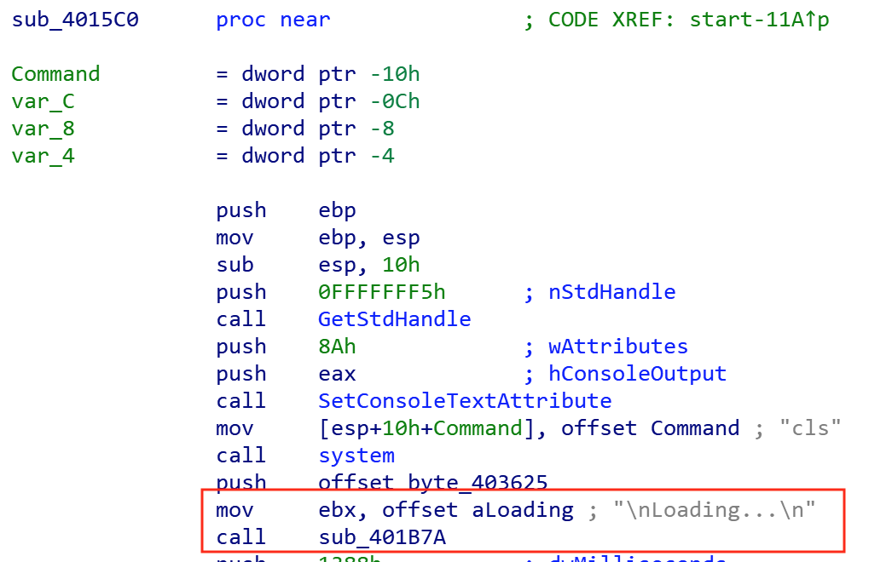

Following that first call, and comparing it to other parts of the code, you can tell its just taking the seen text and using the C function "putchar" to write it out to the screen one letter at a time.  By moving one char to the al register, then doing a cmp for 0 is a way to check for the end of the string.  If its done, exit, if not keep looping and writing to stout.

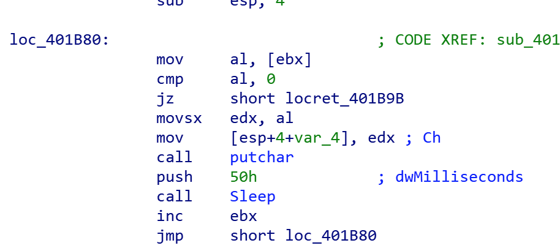

Going back to the first function, lets see if we can tell what else its doing.  Note: anywhere we see sub_401B7A,,that is going to write items to stout.

There is some more welcome text printed, with various sleep commands.

The next interesting part is here.  We see scanf taking the user input (asking for pw), but also doing %4s.  If we look at the documentation for the C function scanf, you can see its scanf(format,input), so in this case, its using a mov for the user input first, then using another one for the formatting command.  Since its last on first off, that fits the format for this function.
Note: The scanf function format is actually a way to limit the input to 4 chars.  No matter what the user enters, it only takes the first 4.

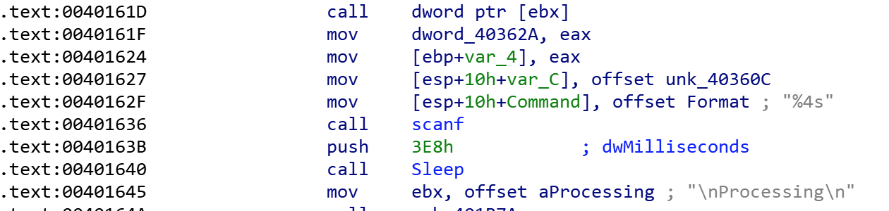

Lets follow the function call to sub_401B5C and see if we can tell where its trying to compare our entered pw with what is expected.

Checking this function, you can see its moving unk_40361C into edi and also setting up a counter for the expected string length before calling a repe cmpsb.  So its interesting here that we are limited to 4 chars for input, but the expected pw is 8.  It seems impossible to enter the matching password right now.  The funny part is,,even if it did match, the path is the same, just the pw is wrong text isn't displayed.  More or less, its impossible to enter a correct pw here and even if you did, it doesn't matter.

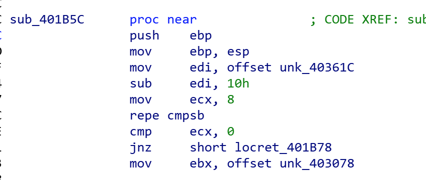

Here is the hex values (with ida ascii conversion for readability), for the expected good pw.

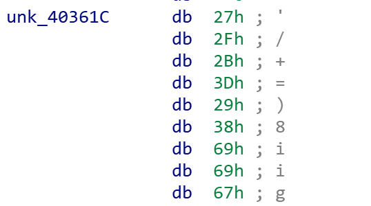

Now if we go back to the beginning and follow a bit more, you can see clear screen and then more "welcome guest" text being written to the screen, along with more scanf formatting, this time looking for a single digit.  This is the "menu" asking what option you want.

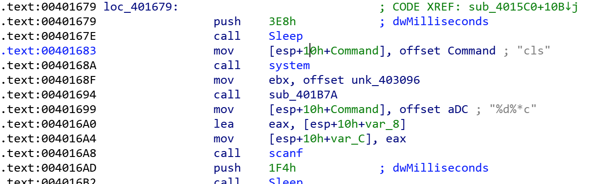

Take a look at all of them, but what I was interested in was the elevate priv option.

Following this, its easy to see that is doing basic checks (similar to if/else logic), checking for the number you entered.

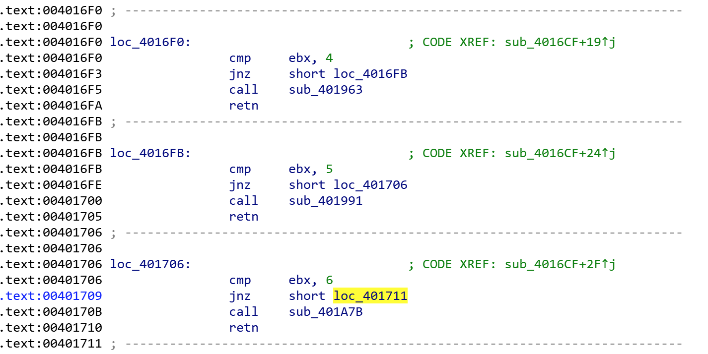

Since we want #6, lets follow the call to sub_401A7B

The first part we can see is moving a byte to al and then performing a rotate/carry left.  Spoiler, if you follow option 5, you can see that its setting this value as a marker.  Basically, they want you to run option 5 first.  This is making sure that happened.  If it did, continue, if not, exit.

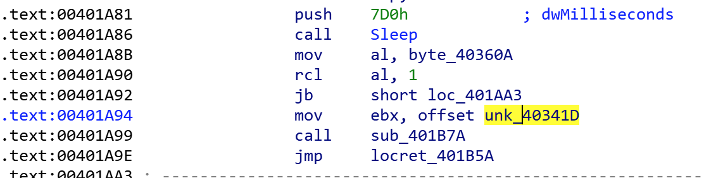

Lets assume that flag is set, and follow along, taking the short jump to loc_401AA3.

Here there is another quick check on that same flag to make sure you aren't already root.

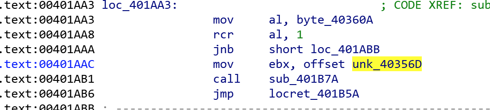

Assuming we aren't already root, lets take the short jump to loc_401ABB, where it finally prompts you for your emergency pw.  This is again done with scanf, and limited to 11 chars.

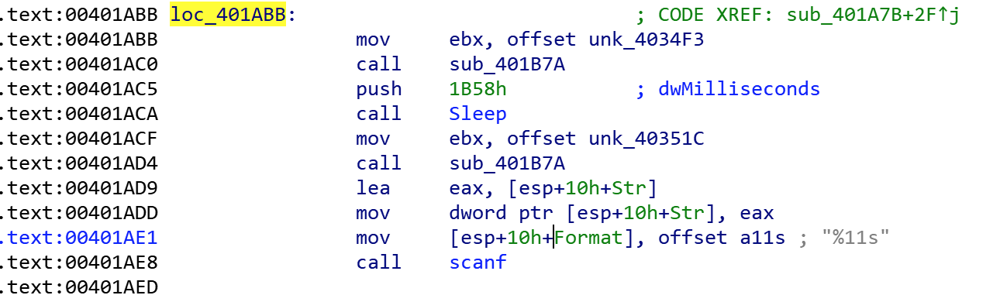

Next, it takes that input and check for the newline character by comparing the first char (in al) to "0AH".  After that it calls the C function strlen, which just returns the length of the input string, which in this case is the pw we entered.

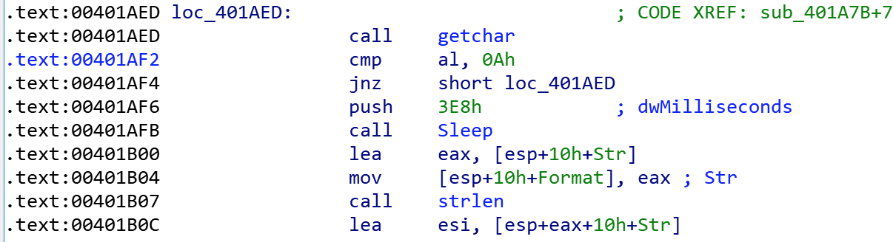

Here is where it starts to get interesting.

Since eax holds the returned value from the strlen function, its moved into the counter register (ecx).  That value is then has a bitwise NOT applied and then incremented.

Next, it does a quick check on the expected pw (which we saw earlier), and is now stored in byte_403625+ecx.  Its taking the first char there, moving it to the al register and making sure its not zero (indicating the end of the string).  You don't want to take that jump yet as the input pw and expected need to be compared first.

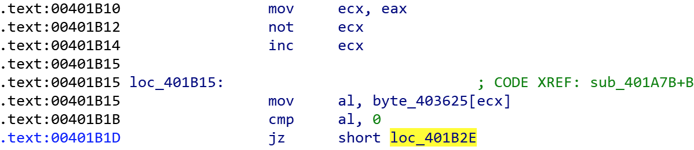

Now, its going to take the effective address of our counter ecx + 60h and place that in ebx.  At this point we have our expected character in register AL and something more random in BL.  Those are then bitwise XOR'd, and your input is compared to that result with a final cmp al,bl. If there is a match, increment the counter (ecx) and keep going, otherwise break/exit.

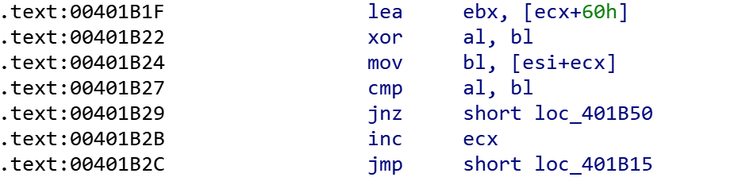

We now know how the pw is compared.  The length of 9 > value of 9 bitwise NOT, add hex 60 and increment.  That will be bitwise XOR'd with the known value to generate the pw input value.

For a better explanation of how this is computed and to generate this pw in a script.  I created the keygen.py file in this directory.  I added tons of comments to help understand it better.

Script output:

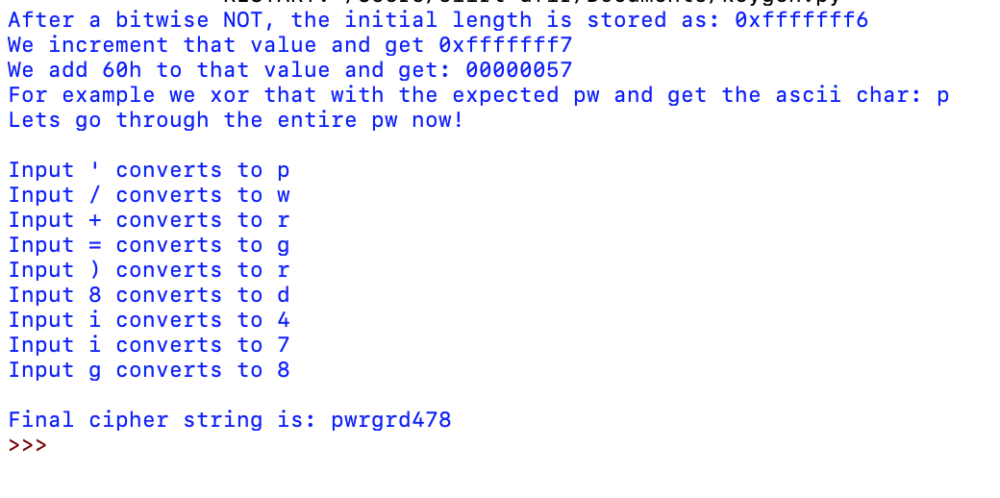

Lastly, now that we have the "emergency pw", the rest is easy to follow in the code, look at the included reference sheet or just a little trial and error.

Basically:
1. Input any pw you want, it doesn't matter.
2. Manual reboot (5)
3. Elevate priv (6)
4. Enter cipher pw
5. Manual reboot (5)
6. Activate grid (y)
7. Toggle Power Generators (3)

