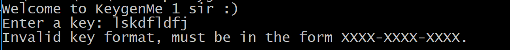
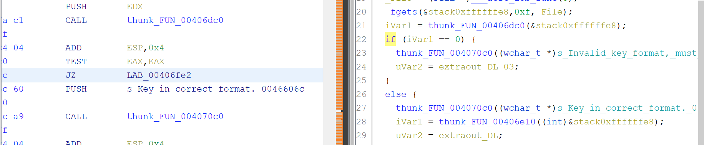
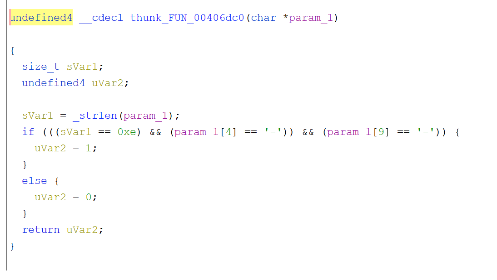
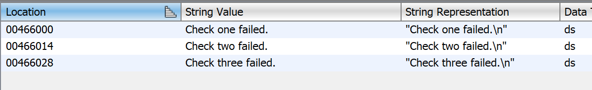
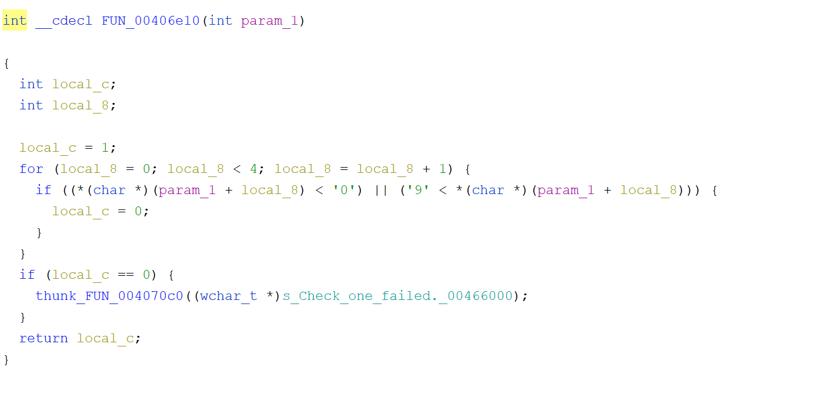
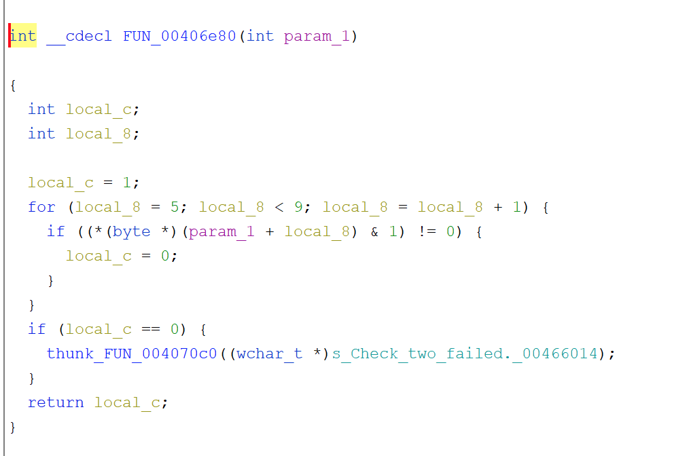
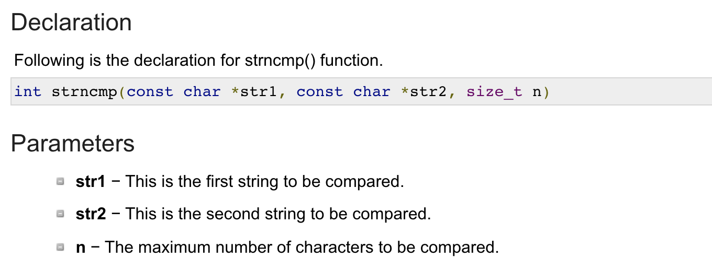
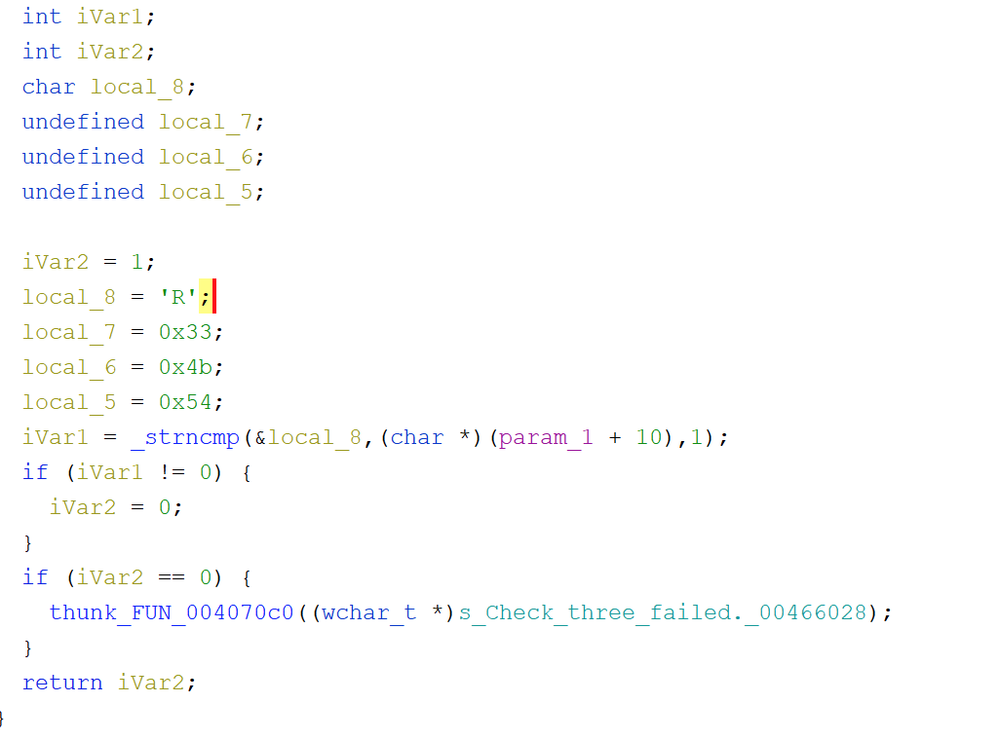

First lets run the program and see what it wants, etc.
 

 
Ok, so it says it's looking for a key in the xxxx-xxxx-xxxx format, let's confirm that.
 
If we search for the known string and backtrack just a little we can see the test eax eax, which is checking the result of the call to thunk_FUN_00406dc0.  Let's follow that:
 

 
Confirmed, here you see a basic function looking for the hyphen in the #4 and #9 spot,,which counting from zero would be 5 and 10.
 

 
Now that we know what it's looking for, lets dig into each section as its doing specific checks for each one:
 

 
 
First check:
 
Again let's look at where the string is being used, backtrack past the cmp to the function call. 
 
We are going to be looking at FUN_00406e10 here.
 
So this is a very simple for loop.  It's going to take the entire string, go through the first 4 positions (0-3), one at a time (via count variable local_8).  In each one it's going to check and make sure it's not less than 0 or greater than 9.  If it is, it writes out the failed message.  So basically any number between 0-9.
 

 
Second check:
 
We are going to look at FUN_00406e80 for the 2nd check.  Now we are going through the next set of numbers at 5-8 and again using local_8 as the inc count.  So it takes each number and performs a bitwise AND with the number 1.  As long as it's not zero, it's valid.  Some quick AND testing shows that any "even" number would qualify as valid here.
 

 
Third check:
 
Now we are looking at FUN_00406ee0.  In this one we can see some actual character values being set to local variables.  Such as local_8 being set to 'R'.  Other variables are being set to 3KT, however let's take a look at that strncmp first and see how it's being used.
 

 
So we basically give it two strings and the length to compare.  In this case, it passes in a "1".  So even though other variables are being set, the only requirement is the 'R'.  Nothing else matters here.
 

 
So final answer is:
First 4: Anything between 0-9.
Second 4: Any even numbers.
Third 4: 'R' followed by anything you want.
 
See the related keygen to make all the keys you want.
