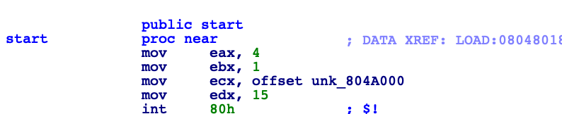
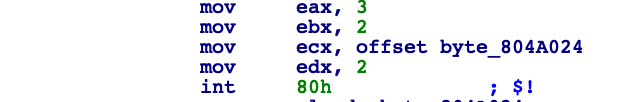
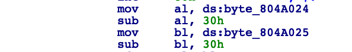
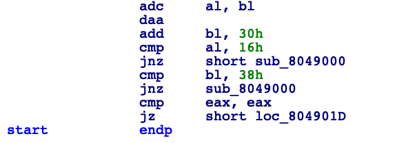
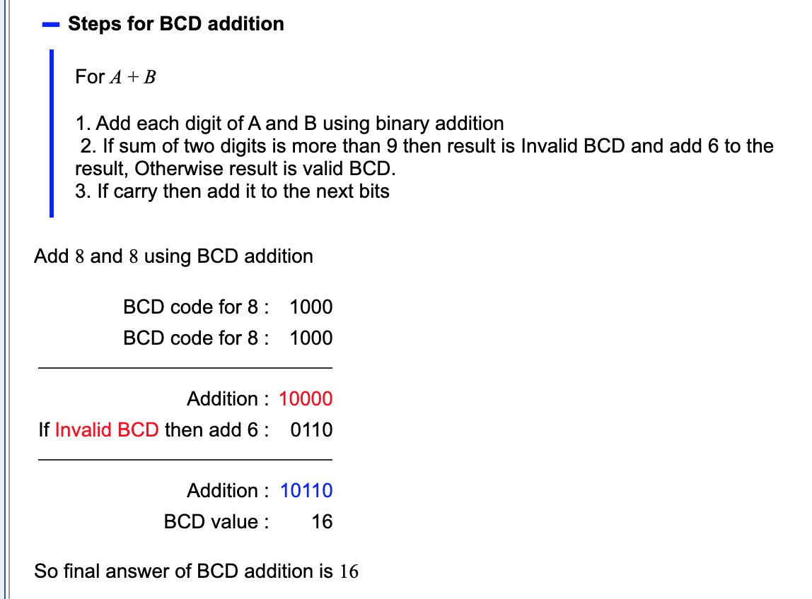

So for this one, I didn't find anything in Ghidra more useful than IDA, so we will just stick with that.
 
First by running the program, you can see it asks for "lucky numbers", without any suggestion for format, length, etc.  Even entering some wrong values doesn't help with that.  However, you can see by entering more than two digits, the program will exit and the next values are interpreted by the command line as the next command.
 
Given this, we know its two digits.  Let's take a look at the setup and other items we can figure out.
 
The first thing we see is the common "int 80h", which is a normal unix syscall.  The mov eax,4 is the system call number for "sys_write" and the mov ebx, 1 is the file descriptor for stdout.  So it's taking the message in unk_804A000 (Lucky numbers:) and sending that to the screen.
 

 
Next, we see another syscall (80h), which is setting up for reading the input.
 

 
In this next section, it's taking that input, one byte at a time and setting them to the lower parts of the eax and ebx registers, al and bl.  The first byte in al and the second in bl.
 
In addition, it's also doing a sub 30h on both, which is just the way in assembly that an ascii char input is being converted to a decimal number so that math can be performed.
 

 
Now is where things get interesting. 
 
al and bl are added together and the result is stored in al.  The daa instruction is given (more on that later), and then al is compared to 16h and bl is compared to 38h.
 
As we follow bl through this, nothing is actually changed there.  It's converted from ascii input to decimal and then back again with the inverse (add 30h).  In the end, the cmp is looking for bl to equal 38h, which is ascii "8".
 
So with that we know that the second number is 8, what about the first.
 
Let's look at the Add with Carry and then the following DAA (which is binary coded decimal).  In DAA, in working with BCD, it states that if the resulting number is more than 9, then we have to add 6.  In this case, we know our final result needs to be 22, so let's create an equation around what we know and solve for "x".
 
So what we are trying to solve is this:
 
x + 6 + 8 = 22?
 
Answer is 8.
 

 
Here is the way you can look at the math in binary.  This is showing 8+8 is actually 16h or 22 decimal here.
 

 
In the end the answer is 88. 
 
Sorry, no keygen this week as it's not needed here.
 
