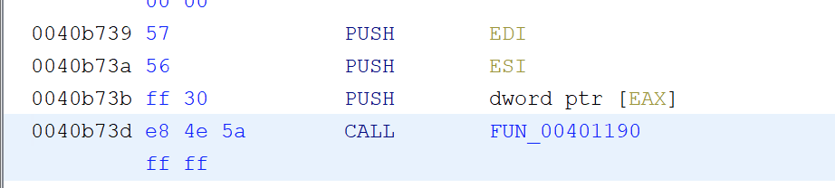
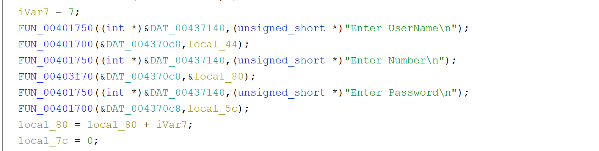
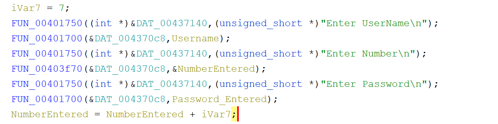
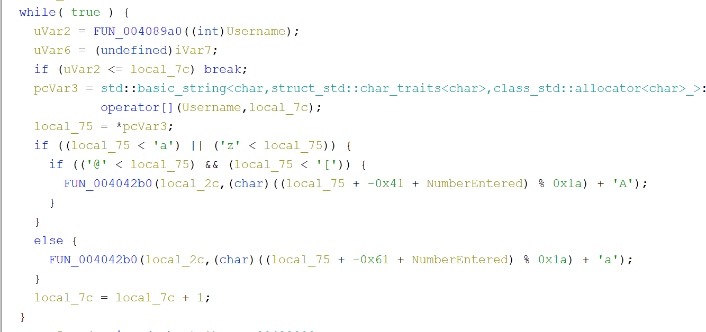
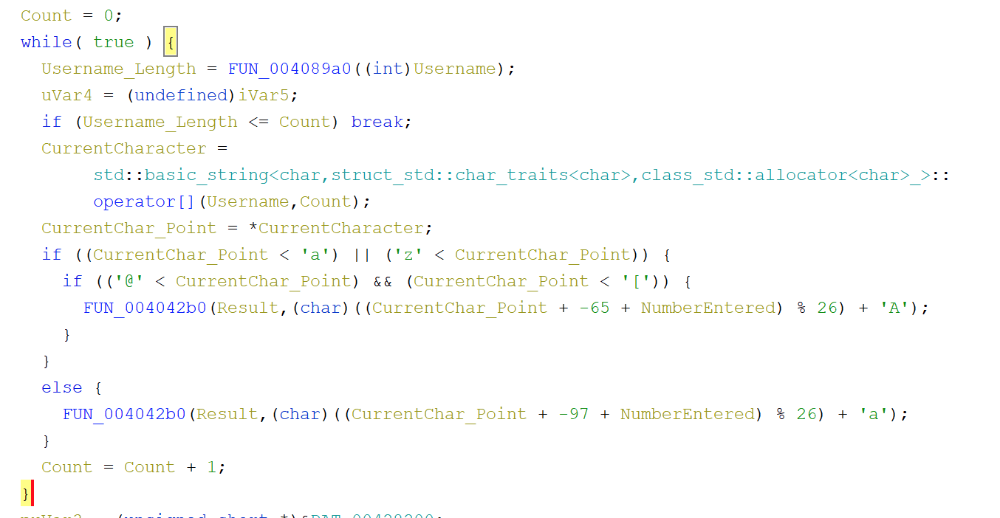
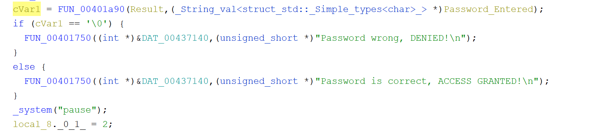
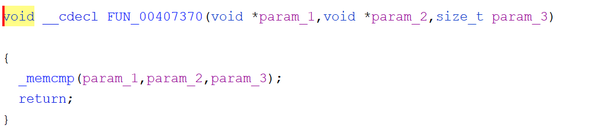
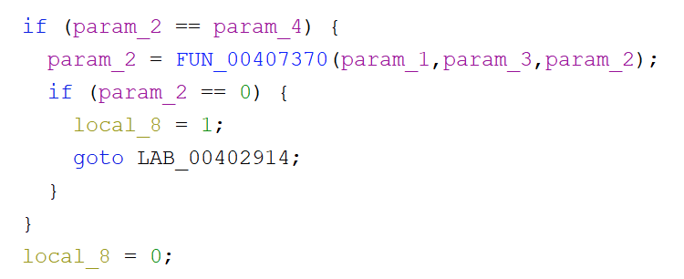
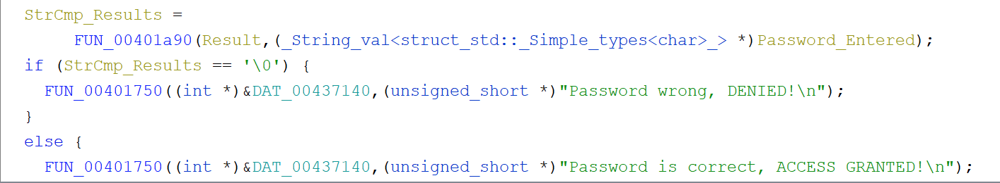

As C++ can differ a little and its a bit harder to determine where to start, its best to look for the "entry" function and/or some string you might expect at the begining and backtrack.  What we are looking for is "main".

This is defined with the pattern of 3 pushes followed by a call.  As the compiler adds a lot of extra code, the entry point is not main and we need to find that first.  The reason for this pattern is because this is implied: int main( int argc, char *argv[], char *envp[] ) and is documented by MS as default main calls: https://docs.microsoft.com/en-us/cpp/c-language/arguments-to-main?view=msvc-160

In this example its here (main is FUN_00401190):

Let's take a look at the start of that function, right after the local var declarations.

In this function, you can see the prompts (cout):

Username = local_44
Number = local_80
Password = local_5c

The next thing you see is that local_80 (The entered number) has ivar7 added, which is 7.  So whatever the user enters, 7 is added to it.

So lets rename those variables to something that makes more sense and proceed.

Now we see that there is a while true loop, which would normally be exited by a break command, which we also see.

Right before this loop, local_7c is set to zero and based on the part at the end, local_7c = local_7c + 1, this appears to be a typical loop counter.

Even without diving into the FUN_004089a0, we can assume that uVar2 is the Username Length.

We now end up with a odd looking if loop.  Normally you count up to length, however this one would still work if you think about it.  If Username_Length is less than or equal to the count, then break this loop.  Basically go through the username string.

Now we look at pcVar2 and based on things we know about loops, its setting the current character in that string as defined by the loop count.  So pcVar2 is the current character.

Right after that, we see local_75 being set as equal to a pointer to that value.  Now local_75 holds the current character in the string.

Now is where things get a little weird in the way it was compiled.  Its looking at the current char and seeing if its less than lower case a OR greater than lower case z.  Then it looks to see if its greater than the character at (@).  Which is an upper A.  Also it has to be less than the left bracket, which is an uppercase Z.

So this is a round about way to see if the character is upper or lowercase in this loop, that's all.

In this loop we see:
(local_2c,(char)((CurrentChar_Point + -0x41 + NumberEntered) % 0x1a) + 'A')

local_2c being the result of the operation here.

Converting some of the numbers here we see:
local_2c,(char)((CurrentChar_Point + -65 + NumberEntered) % 26) + 'A'

In this case, its saying the current character minus 65, which is an upper case A.  Then add the number entered and perform the modulo with 26.  That will ensure the result after adding A back doesn't fall outside of the normal 26 letter alphabet as it will wrap if needed.

The else below that performs the same operations for lowercase letters.

After renaming the variables to make sense we have:

Ok, now we are out of the while loop and our chars are shifted by the number the user entered plus 7 and we see this next.

If we follow FUN_00401a90, which passes in the result of the shift and the entered password as parameters, you can see we do finally end up at a memcmp, or string compare in C.  The format is int memcmp(const void *str1, const void *str2, size_t n), which we see here.

Going back one image, we now know that this is a simple string compare with the shift result and the user entered pw. 

Even though this ends in memcmp, you can see the calling function is returning the opposite as 1 is equal zero not equal.

So if its equal to zero, then return wrong pw, else return correct.  Then a normal pause to hold the screen and thats it.

The final result with the names changed is this:

In the end, this takes the user entered password and shifts each letter in the username that number plus 7 and expects that for the entered pw.  As such a simple caesar cipher with twist.
