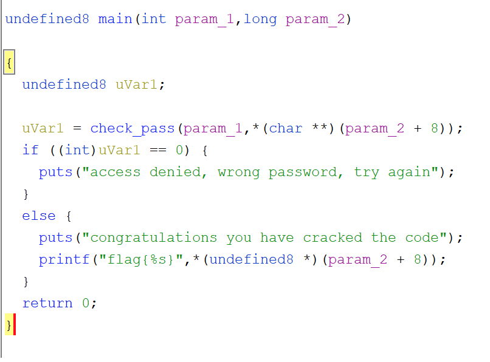
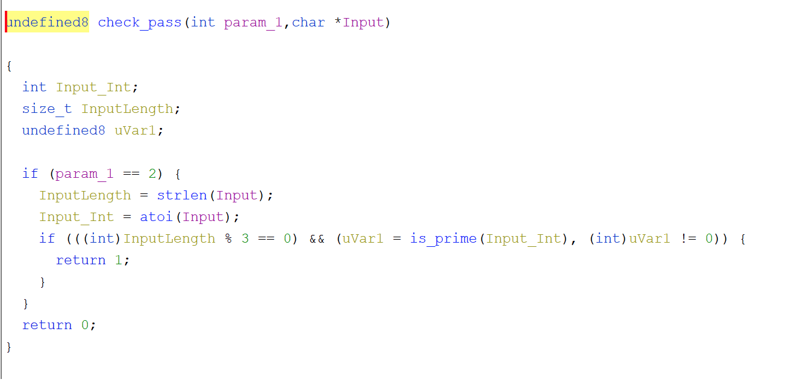
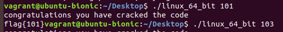

Looking at this in Ghidra, you can see the "main" function has actually been identified, so no guess work there.

So here in main we can see some parameters being passed directly to check_pass.  The result of that being uVar1 if then the determining factor in if we get a pass or fail.  

Based on what is happening here, we can make some safe assumptions.  Its doing a strlen and an atoi.  So both of those would have to be on the value we are passing in.  For example its getting the actual length of the value we entered plus converting that string input to an int value.  My guess is that param1 is just checking for a cmdline arg being passed at all, if not skip the logic check.

So now lets look at the IF statement.  We already know we want a return value of "1" as zero is a fail.

if (((int)InputLength % 3 == 0) && (uVar1 = is_prime(Input_Int), (int)uVar1 != 0))

In this line, I already changed the local variable/parameter names to help make sense of it.  So its looking to see if the input length modulo with 3 equals zero.  As the modulo operator returns the remainder from division, the only way to make this true is for the input length to be divisible by 3.  Ok, so 3,6,9,etc has to be the length.

Next, its running the function is_prime on the input value and storing that in uVar1.  Its then checking to see if uVar1 is not zero.  That is_prime function is doing exactly what it sounds like.  Check the number to see if its prime, if it is, uVar1 equals 1, otherwise, its zero.  So the second condition is that the number is prime.

Nice, so our conditions are that its a prime number with a length divisible by 3.  The first one that I saw was 101, which gives a successful result.

