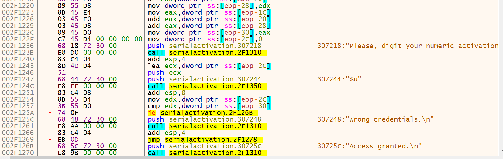

Loading this up in Ghidra, lets first look for main as we normally do in C++.  This is 3 pushes followed by a call, which is the function for main.

Lets dive into this main function:

By doing a little review we can rename some of the functions that are obvious.  Items like the print function is fairly easy to see.  Then we see its taking the user input and making sure its length is 9.  If its not, exit the program.

Now is where things get hard to read.  I can't understand why Ghidra is using some of the values that it is.  Its a little easier by looking at the actual assembly but to actually tell what is going on, I went to a debugger.

In the image below, I have a breakpoint set at the end of the for loop.  Its too  many things to list here but if you single step through each of these and follow them, its much easier to tell what its doing.  Its doing a loop 100 times and the function actually looks like this:

`res1 = ((value[0]+value[5]) ^ (value[2] | value[6])) & 0xF`  
`c1 += res1`  
`res2 = ((value[8] + (value[1] + value[7])) ^ c1) & 0xF0`  
`output+= res2`

with the value[x], being input serial value = [1,2,3,4,5,6,7,8,9]

Looking at what Ghidra did with the logic on the final password compare also seems odd.  Take a look at the image below from the C like analysis.

This image makes much more sense in that its moving local_30 into EDX, then comparing that value in EDX with what is stored in local_34.

Lets take a closer look in x32dbg about how that gets created.

The final setup is at 002F1223, where ebp-1C is moved into EAX, then ebp-20 and ebp-28 is added to that value stored at EAX.
Next, EAX is moved into ebp-30 and then zero is moved into ebp-2C.  This is all a setup for the user prompt for the digit value.  As the address for ebp-2C is loaded into ECX right before that input call, it will store the result.

The final compare starts to happen at 002F1254, where ebp-2C is moved into EDX, then that value is compared to ebp-30 and the final jump is determined with the "je".  If they match, then it jumps to access granted, otherwise it hits wrong creds.

Long/Short, if we can determine what is being stroed in ebp-30 when it gets to this point, then we know what we need.

Went through the entire section we breezed over earlier in how these values get created, hope this helps.

