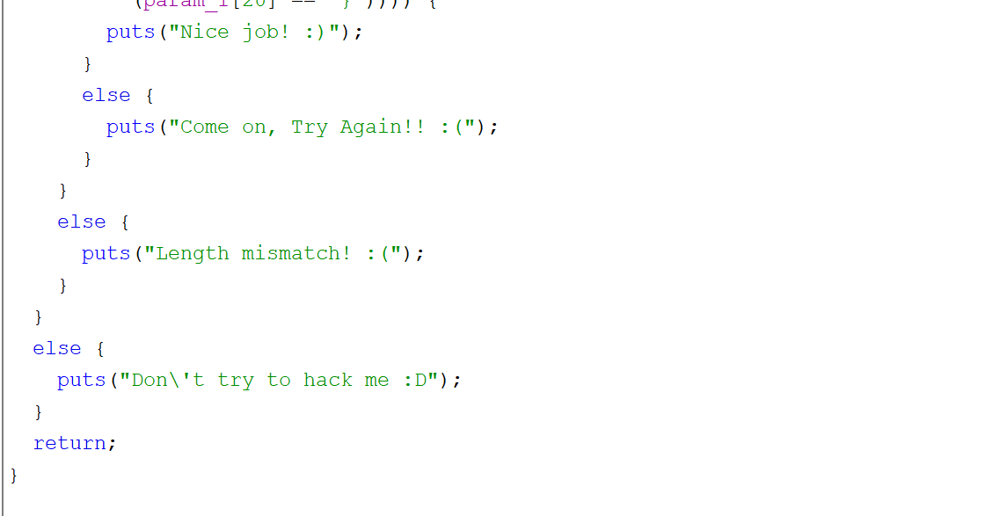

Lets first look at the entry point.  Since this is an ELF written in C, the entry point is the best place to start.

You can see the libc start main function here, lets follow that.

Now this looks like main.  You can see the printf followed by the scanf, which takes the inputpw (yes I renamed a few things to make it easier to follow)

Now we see the inputpw being sent to FUN_001011c9, now lets follow that function.

This is def the function we want.  You can see it first checks for any pw longer than 26, then outputs don't hack me if so.  Otherwise we will either get length mismatch if its between 21-26 or a come on try again.

So at this point, we know we need a pw with the length of 21 and then each char position has to match the given letter in this really long AND statement.  Pretty straightforward here, write it down somewhere or create a quick Python script to order these for you (see keygen here).

Now we can see the final check here.

`Answer: A C T F { N 0 1 c e _ R 3 v 3 r 5 1 ^ g }`
